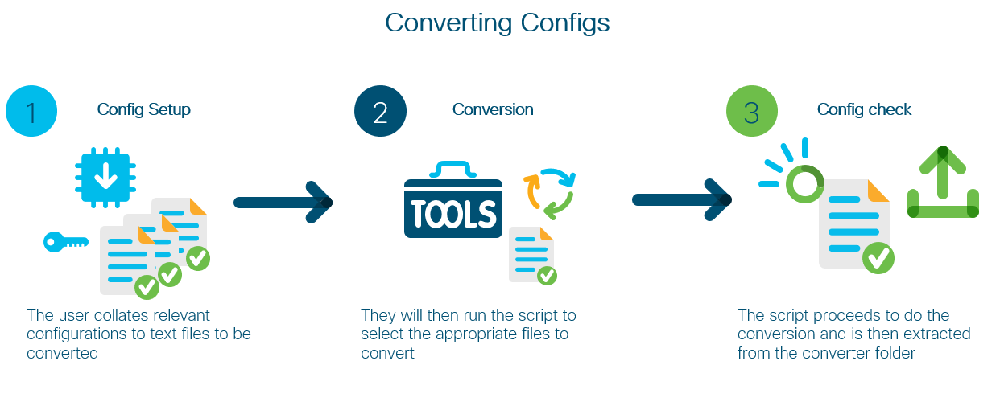
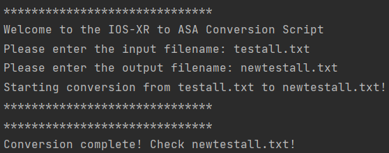

# IOS-XR to ASA Config Converter

This is the IOS-XR to ASA Config Converter source code. Using Python and regex,
we can take configurations for IPv4 and IPv6 access lists and network or groups from
IOS-XR and convert them to the appropriate ASA configs.

### High Level Design


## Contacts

* Josh Ingeniero (jingenie@cisco.com)
* Ahmed Hussein (ahmhusse@cisco.com)

## Solution Components
* Cisco IOS-XR
* Cisco ASA
* Python
* Regex

## Installation:

#### Clone the repo
```console
git clone https://www.github.com/gve-sw/GVE_DevNet_IOS-XR_To_ASA_Config_Converter
```

#### Set up a Python venv
First make sure that you have Python 3 installed on your machine. We will then be using venv to create
an isolated environment with only the necessary packages.

##### Install virtualenv via pip
```
$ pip install virtualenv
```

##### Create a new venv
```
Change to your project folder
$ cd GVE_DevNet_IOS-XR_To_ASA_Config_Converter

Create the venv
$ virtualenv venv

Activate your venv
$ source venv/bin/activate
```


## Setup:
#### Add config files:
You should copy the configuration files to be converted to the [converter](converter) folder.
These should be in the traditional cisco format with configs grouped and separated with an exclamation (!) mark.


## Usage:

### Python
Run the script for testing and follow the prompts
```
$ cd converter
$ python converter.py
```

### Sample Config Conversions
IOS-XR
```cisco
object-group network ipv4 some-ipv4-networks
10.3.15.0/17
10.4.25.51/18
172.23.0.0/15
192.168.0.132/29
!
object-group port some-ports
eq 22
eq 443
eq 194
eq 33573
!
object-group port some-port-range
range 32450 32457
!
object-group network ipv6 some-ipv6-networs
fc00:f84b:1830:8000::/52
fc00:3f0:1859:1000::/52
fc00:1450:1034:9031::/64
fc00:1278:1450:1002::/64
!
ipv4 access-list some-ipv4-acl
 10 remark test
 20 permit icmp any any
 30 remark test-2
 40 permit udp any any port-group the-group
!
ipv6 access-list some-ipv6-acl
 10 remark testing-ipv6
 20 permit udp any any port-group some-ipv6-group
 30 remark testing-remark
 40 permit icmpv6 any any
 50 remark the-other-remark
 60 deny ipv6 any any
!
```
ASA
```cisco
object-group network some-ipv4-networks
network-object 10.3.15.0 255.255.128.0
network-object 10.4.25.51 255.255.192.0
network-object 172.23.0.0 255.254.0.0
network-object 192.168.0.132 255.255.255.248
!
object-group service some-ports tcp-udp
port-object eq 22
port-object eq 443
port-object eq 194
port-object eq 33573
!
object-group service some-port-range tcp-udp
port-object range 32450 32457
!
object-group network some-ipv6-networs
network-object fc00:f84b:1830:8000::/52
network-object fc00:3f0:1859:1000::/52
network-object fc00:1450:1034:9031::/64
network-object fc00:1278:1450:1002::/64
!
access-list some-ipv4-acl line 10 remark test
access-list some-ipv4-acl line 20 extended permit icmp any any
access-list some-ipv4-acl line 30 remark test-2
access-list some-ipv4-acl line 40 extended permit udp any any object-group the-group
!
access-list some-ipv6-acl line 10 remark testing-ipv6
access-list some-ipv6-acl line 20 permit udp any any object-group some-ipv6-group
access-list some-ipv6-acl line 30 remark testing-remark
access-list some-ipv6-acl line 40 permit icmpv6 any any
access-list some-ipv6-acl line 50 remark the-other-remark
access-list some-ipv6-acl line 60 deny ipv6 any any
!

```
### Screenshot
#### Script Run



### LICENSE

Provided under Cisco Sample Code License, for details see [LICENSE](LICENSE.md)

### CODE OF CONDUCT

Our code of conduct is available [here](CODE_OF_CONDUCT.md)

### CONTRIBUTING

See our contributing guidelines [here](CONTRIBUTING.md)

#### DISCLAIMER:
<b>Please note:</b> This script is meant for demo purposes only. All tools/ scripts in this repo are released for use "AS IS" without any warranties of any kind, including, but not limited to their installation, use, or performance. Any use of these scripts and tools is at your own risk. There is no guarantee that they have been through thorough testing in a comparable environment and we are not responsible for any damage or data loss incurred with their use.
You are responsible for reviewing and testing any scripts you run thoroughly before use in any non-testing environment.